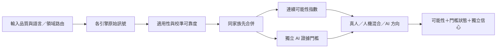

# TruthLens vNext 作者判讀設計

## 目的與邊界

TruthLens 判讀的是「這份文字較可能由誰、以何種方式完成」，不是判定抄襲、內容
正確性或學術不端。系統固定區分三個方向：

1. **較可能真人撰寫**：連續證據指數偏向真人，或有可靠真人寫作過程／來源佐證。
2. **較可能人機混合**：已越過 AI 證據門檻，且句段視窗同時存在穩定的 AI 與真人區段。
3. **較可能 AI 生成**：連續證據指數偏向 AI；報告另行標示是否已有直接痕跡、至少兩個獨立家族支持，或一個經嚴格校準的極強訊號。

畫面上的「AI 可能性」是證據指數，不宣稱是母體中作者身分的統計機率。信心必須
分開呈現，內容品質、引用品質與任務契合不得偷偷加進作者勝算。

## 市場與研究基準

- Turnitin 對低於 20% 的結果不顯示精確比例，並明示偽陽性風險及不可作為不利
  決策的唯一依據。TruthLens 採用相同優點：低證據不包裝成確證；但仍提供明確的
  較可能方向與獨立信心，避免只回覆「無法判別」。
- GPTZero 分開提供文件／句子判讀與信心，並承認 AI 偵測是機率式預測。TruthLens
  保留逐句訊號，但混合判讀只在足量視窗同時出現兩種方向時成立。
- RAID 涵蓋多模型、多領域、解碼策略及對抗攻擊；NAACL 2025 的實務研究顯示，
  一些偵測器在 1% FPR 操作點的召回率可低至 0%。因此不能拿單一整體 accuracy
  當發布證明，必須報告 `TPR@FPR`、跨領域與攻擊分組結果。
- DetectGPT、Fast-DetectGPT 與 Binoculars 類零樣本方法可補足監督式分類器的
  分布盲點，但同樣會受來源模型、領域與改寫影響。沒有獨立校準集前只能是候選
  家族，不能因論文數字漂亮就直接啟用。
- 非母語英文作者會被部分偵測器不成比例地誤判。TruthLens 的統計家族因此套用
  語言適用性及 ESL 下修，且公平性分組是發布閘門，不是報表裝飾。

主要依據：

- [Turnitin AI Writing Report](https://guides.turnitin.com/hc/en-us/articles/22774058814093-Using-the-AI-Writing-Report)
- [GPTZero technology](https://gptzero.me/technology)
- [RAID benchmark](https://arxiv.org/abs/2405.07940)
- [Practical Examination of AI-Generated Text Detectors, NAACL 2025](https://aclanthology.org/2025.findings-naacl.271/)
- [DetectGPT, ICML 2023](https://proceedings.mlr.press/v202/mitchell23a.html)
- [Binoculars, ICML 2024](https://proceedings.mlr.press/v235/hans24a.html)
- [Bias against non-native English writers](https://arxiv.org/abs/2304.02819)

## 融合契約

四個證據家族及最高設定權重為：監督式分類器 40%、分布／困惑度 25%、風格 20%、
改寫痕跡 15%。這是上限而非保證取得的權重。本次有效權重由下列與結果方向無關的
因素決定：

- 模型對該語言與領域是否經過驗證。
- 校準資料品質及固定 FPR 操作點表現。
- 文件長度、可分析句數與引擎實際覆蓋率。
- ESL、公平性與已知偏差修正。
- 同家族多模型只能先合併，不能當作多份獨立證據。

嚴禁以「本次分數較高」「較符合預期答案」為理由提高權重。內容完整性、引用、
任務契合、貼上行為與可疑中繼資料保留為核查面向，但不能產生 AI 作者判定。

## AI 證據門檻

AI 方向至少符合一項：

- 命中可直接核實的生成來源痕跡，例如經驗證的 watermark／provenance，或多個
  明確助理回覆外框殘留。
- 至少兩個獨立證據家族同時支持 AI。
- 單一監督式或分布家族達 90%，且校準可靠度至少 80%。此規則只適用於完成
  固定 FPR 校準的模型。

連續證據指數不因未通過門檻而人工截成 49%。若數值略偏 AI，系統可顯示
「較可能 AI」，但必須同時標示「AI 證據門檻未通過，僅供方向篩查」並降低信心；
這不能用來升級處置或單獨支持不利決策。人機混合仍要求通過門檻、至少五個可分析視窗，
AI 與真人視窗各占至少 15%，避免用一兩句波動製造混合標籤。

若所有引擎都未達正式證據門檻，整合層仍保留四引擎原始診斷分數的方向，
但以低可靠度向中性點收縮。顯示值低於 50% 才能顯示「較可能真人」；精確 50%
顯示「AI 與真人訊號相當」；高於 50% 才顯示「較可能 AI」。這些結果的信心仍為低，
且不會因而通過 AI 證據門檻。

## 發布閘門

任何新模型、閾值或家族只有在未參與訓練及調參的文件級測試集通過後才能啟用：

1. Calibration 與 test 必須按原始文件／題目 `group_id` 隔離，同一題的人類、AI、
   改寫與人類化版本不得跨集合。
2. 在 calibration 選擇固定 FPR 閾值，在 test 報告 FPR、95% Wilson 上界及 AI recall。
3. 整體 FPR 上界須不高於產品目標，recall 須達最低要求。
4. 語言、領域、生成模型、寫作風格、攻擊方式、AI-generated／AI-assisted 等足量
   分組必須逐一通過；產品宣稱支援的語言／領域可設為 required，缺少足量樣本時
   發布直接失敗。不適用的分組應路由為 unknown／unsupported，而非猜測。
5. 偽陽性輸出 hard negatives，漏判 AI 輸出 hard positives；加入下一輪訓練後，
   必須更換未見測試文件重新評估。

工具為 `training/evaluate_operating_point.py`。目前 Binoculars 語料只有單一真人來源、
沒有 AI 對照，不符合最低校準條件，因此維持未啟用；不得把論文報告的操作點直接
移植成本產品閾值。
