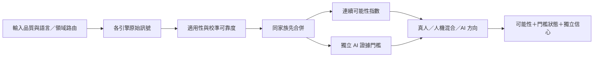

# TruthLens vNext 作者判讀設計

## 目的與邊界

TruthLens 判讀的是「這份文字較可能由誰、以何種方式完成」，不是判定抄襲、內容
正確性或學術不端。系統固定區分三個方向：

1. **較可能真人撰寫**：連續證據指數偏向真人，或有可靠真人寫作過程／來源佐證。
2. **較可能人機混合**：已越過 AI 證據門檻，且句段視窗同時存在穩定的 AI 與真人區段。
3. **較可能 AI 生成**：連續證據指數偏向 AI；報告另行標示是否已有直接痕跡、至少兩個獨立家族支持，或一個經嚴格校準的極強訊號。

畫面上的數字統一稱為「AI 證據指數（0–100）」，不再使用帶有母體機率暗示的
百分比符號。信心另外以「證據充分度（0–100）」和低／中／高層級呈現；內容品質
與引用品質不得偷偷加進作者勝算。

## 市場與研究基準

- Turnitin 對低於 20% 的結果不顯示精確比例，並明示偽陽性風險及不可作為不利
  決策的唯一依據。TruthLens 採用相同優點：低證據不包裝成確證；但仍提供明確的
  較可能方向與獨立信心，避免只回覆「無法判別」。
- GPTZero 分開提供文件／句子判讀與信心，並承認 AI 偵測是機率式預測。TruthLens
  保留逐句訊號，但混合判讀只在足量視窗同時出現兩種方向時成立。
- PAN 2025 Generative AI Authorship Verification 明確以新模型、未知混淆與模仿
  人類文風為挑戰；官方驗證集上的 TF-IDF／SVM 基準 ROC-AUC 為 0.996，顯示詞彙
  與片語分布可補足神經分類器的分布盲點。TruthLens 已移植其 1–4 gram、1000
  特徵線性模型，完全在裝置端執行；這是單一基準的排序能力，不等於產品已達
  99.6% 準確率，也不取代跨領域固定 FPR 驗證。
- RAID 涵蓋多模型、多領域、解碼策略及對抗攻擊；NAACL 2025 的實務研究顯示，
  一些偵測器在 1% FPR 操作點的召回率可低至 0%。因此不能拿單一整體 accuracy
  當發布證明，必須報告 `TPR@FPR`、跨領域與攻擊分組結果。
- DetectGPT、Fast-DetectGPT 與 Binoculars 類零樣本方法可補足監督式分類器的
  分布盲點，但同樣會受來源模型、領域與改寫影響。沒有獨立校準集前只能是候選
  家族，不能因論文數字漂亮就直接啟用。
- 非母語英文作者會被部分偵測器不成比例地誤判。TruthLens 的統計家族因此套用
  語言適用性及 ESL 下修，且公平性分組是發布閘門，不是報表裝飾。

主要依據：

- [Turnitin AI Writing Report](https://guides.turnitin.com/hc/en-us/articles/22774058814093-Using-the-AI-Writing-Report)
- [GPTZero technology](https://gptzero.me/technology)
- [RAID benchmark](https://arxiv.org/abs/2405.07940)
- [PAN 2025 official task and baselines](https://pan.webis.de/clef25/pan25-web/generated-content-analysis.html)
- [PAN 2025 official corpus](https://doi.org/10.5281/zenodo.14962653)
- [Practical Examination of AI-Generated Text Detectors, NAACL 2025](https://aclanthology.org/2025.findings-naacl.271/)
- [DetectGPT, ICML 2023](https://proceedings.mlr.press/v202/mitchell23a.html)
- [Binoculars, ICML 2024](https://proceedings.mlr.press/v235/hans24a.html)
- [Fast-DetectGPT, ICLR 2024](https://openreview.net/forum?id=Bpcgcr8E8Z)
- [Ghostbuster](https://arxiv.org/abs/2305.15047)
- [BUST, NAACL 2024](https://aclanthology.org/2024.naacl-long.444/)
- [M4, EACL 2024](https://aclanthology.org/2024.eacl-long.83/)
- [Bias against non-native English writers](https://arxiv.org/abs/2304.02819)

## 融合契約

四個引擎角色的最高設定權重為：監督式分類器 40%、分布／困惑度 25%、風格 20%、
改寫痕跡 15%。英文長文的風格角色可由 PAN 詞彙指紋家族接手；它與規則式風格
不會同時重複計票。這些設定都是上限而非保證取得的權重。本次有效權重由下列與
結果方向無關的
因素決定：

- 模型對該語言與領域是否經過驗證。
- 校準資料品質及固定 FPR 操作點表現。
- 文件長度、可分析句數與引擎實際覆蓋率。
- ESL、公平性與已知偏差修正。
- 同家族多模型只能先合併，不能當作多份獨立證據。

嚴禁以「本次分數較高」「較符合預期答案」為理由提高權重。內容完整性、引用、
可疑中繼資料保留為核查面向，但不能產生 AI 作者判定。整篇一次貼上只代表文字
如何進入工作區；沒有觀察到逐字撰寫時，寫作過程軸直接標為不可取得，不列警訊。

## AI 證據門檻

AI 方向至少符合一項：

- 命中可直接核實的生成來源痕跡，例如經驗證的 watermark／provenance，或多個
  明確助理回覆外框殘留。
- 至少兩個獨立證據家族同時支持 AI。
- 單一監督式、詞彙指紋或分布家族達 90%，且校準可靠度至少 80%。此規則只適用於完成
  固定 FPR 校準的模型。

連續證據指數不因未通過門檻而人工截成 49%。若數值略偏 AI，系統可顯示
「較可能 AI」，但必須同時標示「AI 證據門檻未通過，僅供方向篩查」並降低信心；
這不能用來升級處置或單獨支持不利決策。人機混合仍要求通過門檻、至少五個可分析視窗，
AI 與真人視窗各占至少 15%，避免用一兩句波動製造混合標籤。

只有 `votes=true` 且具有校準可靠度的引擎可提供方向。`raw_avg_prob` 等診斷欄位
不能繞過投票契約；未命中特徵的 0 分也不能反推為真人證據。同一家族偏離中性的
有效訊號可以參與連續方向，但只有跨過 38%／62% 或直接痕跡者才計入強證據門檻。
機率與可靠度分開處理：前者回答方向，後者只決定有效權重，禁止先把機率折回 50
再重複乘一次可靠度。

有方向性證據時，指數低於 50 顯示真人方向，高於 50 顯示 AI 方向；但 42–58 且信心低時必須改用
「目前偏向真人／AI，但接近分界」，不能把 49／51 包裝成穩健二元判定。畫面同時
明列距 60 分 AI 升級線的差距及證據充分度。真正沒有任何可用方向時顯示「未檢出
明確 AI 主導訊號」，不再宣稱 AI 與真人證據相當。方向中點 50 與 AI 升級線 60
是兩個不同概念，且升級仍須通過獨立證據門檻。完全沒有作者特異性證據時，不再
輸出 50 或沿用舊四引擎 fallback 分數，畫面、PDF、JSON 與 CSV 一律標示「無法估算」。

## 統計家族連續計分

統計引擎不得把內部中性值 0.5 顯示成「AI 機率 50%」。本次沒有任何指標跨過
校準門檻時，輸出仍可在內部保留 0.5 代表棄權，但畫面必須顯示「未形成方向性
訊號」且不畫 50% 長條。只有形成方向的特徵才參與家族融合。

形成訊號後，困惑度、句長起伏與 MATTR 依實際觀測值離校準切點的距離映射為
連續指數，再以 `Σ(訊號比率 × 權重) / Σ有效權重` 線性累積；不再採固定
`+28／+20／+10`、`-25／-20` 百分點或不可回推的非線性融合。只有本次適用且
產生方向的矩陣會進入分子與分母，結果同時保留各項權重、加權量與正負貢獻，
可由報告或測試完整重算。這讓兩篇都命中「句長均勻」的文件仍會因均勻程度不同
而得到不同分數，同時保留中性帶與單向門檻，避免為了讓數字好看而製造偽證據。

英文 100 詞以上另加入跨半段壓縮一致性（CBC）。以 PAN 2025 訓練集真人分布第
95 百分位 0.1832 作單向篩線；內部重算的驗證集表現為 AUC 0.766、FPR 7.5%、
AI recall 35.1%，因此只占統計家族 20% 的低權重。超線可形成弱 AI 方向，未超線
必須沉默，不能反過來證明真人。

跨引擎整合沿用同一契約：先在同一證據家族內按可靠度線性合併，再以
`Σ(家族指數 × 設定權重 × 校準可靠度) / Σ有效家族權重` 累積四個家族。設定權重
不因本次分數高低而變動；語言／領域不適用、未校準或沒有方向性訊號的家族退出
分子與分母。輸出保留家族加權 AI 量與有效權重總和，避免最終指數成為黑箱。

## 分析家族擴充路線

擴充原則是增加**統計上不同的觀測方式**，不是把更多相似文風規則疊成多數票：

1. **雙模型語言對照（Binoculars）**：數學核心已完成；待兩顆可在各平台本地執行
   的模型、繁中／英文獨立校準集與固定 FPR 測試通過後，加入分布家族的獨立變體。
2. **條件機率曲率（Fast-DetectGPT）**：列為高階裝置候選。它需要 scoring model
   與 sampling model，必須先量測記憶體、延遲及跨語公平性，不能直接套論文門檻。
3. **弱模型特徵集成（Ghostbuster 類）**：只在文件級未見測試集證明跨領域增益，
   且不與現有統計特徵重複計票時，才可成為新家族。
4. **生成來源與簽章**：可驗證 watermark、C2PA／供應商 provenance 或助理回覆
   框架屬高特異性直接痕跡，優先級高於文風猜測；無公開驗證金鑰者不得假裝支援。
5. **文件過程鑑識**：DOCX／ODT 的編輯時長、版本與 RSID 批次繼續獨立呈現。
   批次集中只能說明一次匯入或組裝，不能單獨證明 AI，但可指引後續核查。

目前已落地的補強是 **PAN 2025 詞彙指紋**與 **CBC 壓縮一致性**。前者對使用者提供
的 Gemini 3.1 Pro 範例片段輸出約 80/100，對專案既有 2010 真人學術論文全文約
33/100；後者在同一 Gemini 範例越過真人 95 百分位篩線。這兩個檢查被鎖為不同
家族後才可形成跨家族門檻，任何單篇示例都不會被寫成產品準確率宣稱。

RAID 顯示解碼策略、領域與改寫攻擊會讓既有偵測器顯著退化；BUST 與 M4 也指出
任務、語言及未見生成器的分布轉移不可忽略。因此上列模組都必須通過相同發布閘門，
不能用內部幾篇示例或單一整體 accuracy 宣稱改善。

## 發布閘門

任何新模型、閾值或家族只有在未參與訓練及調參的文件級測試集通過後才能啟用：

1. Calibration 與 test 必須按原始文件／題目 `group_id` 隔離，同一題的人類、AI、
   改寫與人類化版本不得跨集合。
2. 在 calibration 選擇固定 FPR 閾值，在 test 報告 FPR、95% Wilson 上界及 AI recall。
3. 整體 FPR 上界須不高於產品目標，recall 須達最低要求。
4. 語言、領域、生成模型、寫作風格、攻擊方式、AI-generated／AI-assisted 等足量
   分組必須逐一通過；產品宣稱支援的語言／領域可設為 required，缺少足量樣本時
   發布直接失敗。不適用的分組應路由為 unknown／unsupported，而非猜測。
5. 偽陽性輸出 hard negatives，漏判 AI 輸出 hard positives；加入下一輪訓練後，
   必須更換未見測試文件重新評估。

工具為 `training/evaluate_operating_point.py`。目前 Binoculars 語料只有單一真人來源、
沒有 AI 對照，不符合最低校準條件，因此維持未啟用；不得把論文報告的操作點直接
移植成本產品閾值。

發布證據採 `training/benchmark_contract.json` 的版本化契約，優先使用 RAID 檢查
跨生成器、領域、解碼與攻擊韌性，並使用 SemEval-2024 Task 8／M4GT-Bench 補足
多語及人機混合情境。`training/validation/current.json` 是唯一可供 CI 採信的
機器可讀狀態；目前為 `not_yet_externally_validated`。只有獨立測試、資料雜湊、
detector signature、benchmark ID、分組覆蓋與發布閘門均可追溯時才能改為
`validated`，避免內部驗證或單一資料集準確率被誤當成母體信心。
