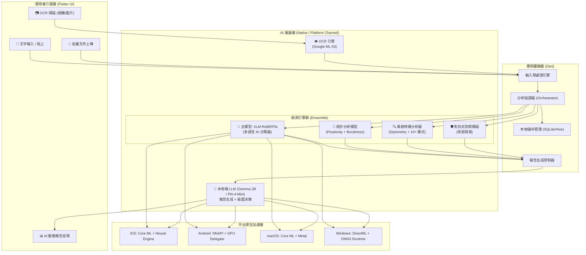
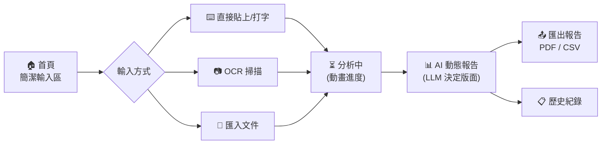
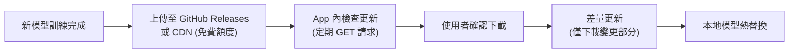
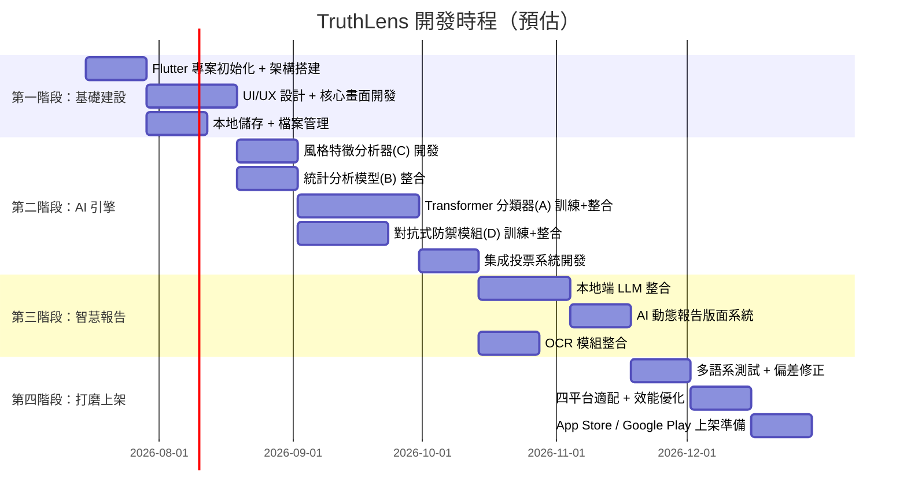

# AI 內容檢測應用程式 — 整體設計架構

> **專案代號**：`TruthLens`（暫定，可更改）
> **目標**：打造一款超越現有市場的、完全本地端運算的跨平台 AI 內容檢測應用程式

---

## 一、核心設計理念

本專案的設計基於對市場上 7 款主流工具（GPTZero、ZeroGPT、QuillBot、Turnitin、Originality.ai、Copyleaks、Winston AI）的深度分析，彙整所有優點並針對性地解決所有缺點。

### 設計原則

| 原則 | 說明 |
| :--- | :--- |
| **完全離線** | 所有 AI 推論在裝置端完成，零伺服器成本、零隱私顧慮 |
| **透明可解釋** | 每一個判定結果都附帶詳細的理由說明，杜絕「黑箱」 |
| **多層級分析** | 文件級 → 段落級 → 句子級 → 詞彙級，層層遞進 |
| **抗規避設計** | 針對改寫工具、同義詞替換、同形字攻擊具備防禦能力 |
| **全球多語系** | 從架構底層就支援多語言，而非英文優先再翻譯 |

---

## 二、市場優缺點整合對照

### ✅ 納入的所有優點

| 來源工具 | 納入的優點 | 在 TruthLens 中的實現 |
| :--- | :--- | :--- |
| GPTZero | Perplexity & Burstiness 深度 NLP 指標 | 核心統計分析引擎的基礎指標 |
| GPTZero | 句子級高亮標示 | 多層級分析系統（句子/段落/詞彙） |
| GPTZero | 改寫盾牌（Paraphraser Shield） | 對抗式防禦模組 |
| QuillBot | 10+ 種 AI 寫作模式辨識 | 模式特徵庫（可擴充） |
| QuillBot | 混合內容偵測（人 + AI） | Multi-way Classifier |
| Turnitin | 保守判定策略（降低偽陽性） | 可調式信心閾值 + 多模型投票 |
| Turnitin | LMS 學習管理系統整合 | 支援匯出 LTI / CSV / PDF 報告 |
| Originality.ai | 寫作歷程分析概念 | 文字輸入模式分析（打字節奏偵測） |
| Originality.ai | 事實查核 + 可讀性分析 | 可讀性評分模組（離線） |
| Copyleaks | 極低偽陽性率 | 多模型集成（Ensemble）投票機制 |
| Copyleaks | 優異的多語系支援 | XLM-RoBERTa 多語言基底模型 |
| Copyleaks | 強大的 API | 提供本地端 IPC / 插件介面 |
| Winston AI | OCR 圖片/手寫辨識 | Google ML Kit 本地端 OCR |
| Winston AI | 精美的可列印報告 | AI 動態生成排版報告 |

### ❌ 解決的所有缺點

| 原始缺點 | 涉及工具 | TruthLens 的解決方案 |
| :--- | :--- | :--- |
| 偽陽性率高（誤判人類文章為 AI） | Originality.ai, ZeroGPT | **多模型集成投票** + **ESL/非母語者偏差修正** + 使用者可調信心閾值 |
| 黑箱作業，不解釋判定原因 | Turnitin, ZeroGPT | **完全透明的逐句解釋** + AI 自然語言報告生成 |
| 無法辨識混合文本（人+AI） | Turnitin | **段落級分段分類**，精準標示人/AI/混合段落 |
| 被改寫工具輕易繞過 | Copyleaks, ZeroGPT | **對抗式訓練**（使用改寫後的 AI 文本訓練） + 改寫偵測模組 |
| 特定 AI 模型盲區（如 Claude） | Winston AI | **多模型特徵庫** + 定期模型更新包機制 |
| 僅限機構購買，不對個人開放 | Turnitin | **一次買斷制**，任何人均可購買 |
| 需要網路連線 | 多數工具 | **100% 離線運算** |
| 訂閱制持續收費 | Originality.ai | **一次性購買**，無後續費用 |
| 英文以外語言表現差 | GPTZero, QuillBot | 多語言 Transformer 模型（104+ 語言） |

---

## 三、系統架構總覽



---

## 四、核心模組詳細設計

### 模組 1：多層級 AI 檢測引擎（核心）

這是整個應用程式最關鍵的部分，採用**集成學習 (Ensemble Learning)** 架構，四個子模型各自獨立評分後加權投票，最終產出判定結果。

#### 子模型 A：多語言 Transformer 分類器
| 項目 | 規格 |
| :--- | :--- |
| 基底模型 | `XLM-RoBERTa-base` (多語言，支援 104 種語言) |
| 微調方式 | 使用人類撰寫 + 各主流 LLM 生成的文本進行二元/多元分類訓練 |
| 量化格式 | INT8 量化（TFLite / ONNX） |
| 模型大小 | ~120MB（量化後） |
| 分析粒度 | 句子級別（每句獨立推論） |

#### 子模型 B：統計特徵分析器
| 項目 | 規格 |
| :--- | :--- |
| 計算指標 | Perplexity、Burstiness、Entropy、Type-Token Ratio |
| 實現方式 | 輕量級語言模型（DistilGPT2 量化版 ~80MB）計算困惑度 |
| 分析粒度 | 滑動窗口（每 3-5 句為一組） |

#### 子模型 C：風格特徵分析器（Stylometry）
| 項目 | 規格 |
| :--- | :--- |
| 檢測特徵 | 10+ 種 AI 寫作模式（過度正式語氣、均勻節奏、術語堆疊、通用過渡詞、重複句式等） |
| 實現方式 | 特徵工程 + 輕量級 Gradient Boosting 模型（XGBoost ~5MB） |
| 獨特價值 | 可解釋性最高，每個特徵都能直接對應到報告中的解釋 |

#### 子模型 D：對抗式防禦模組
| 項目 | 規格 |
| :--- | :--- |
| 功能 | 偵測文本是否經過改寫工具處理（如 QuillBot、Undetectable.ai 等） |
| 實現方式 | 專門使用「改寫後 AI 文本」訓練的分類器 |
| 訓練數據 | 原生 AI 文本 → 經多種改寫工具處理 → 標記為「改寫 AI」類別 |

#### 集成投票機制

```
最終判定 = Σ (子模型_i 的信心分數 × 權重_i)

  模型 A (Transformer): 權重 40%
  模型 B (統計分析):    權重 25%
  模型 C (風格特徵):    權重 20%
  模型 D (對抗防禦):    權重 15%

分類結果：
  ├── 🟢 人類撰寫 (信心 > 80%)
  ├── 🟡 可能人類 (信心 60%-80%)
  ├── 🟠 混合內容 (信心 40%-60%)
  ├── 🔴 可能 AI  (信心 20%-40%)
  └── ⛔ AI 生成  (信心 < 20%)
```

> [!IMPORTANT]
> **ESL/非母語者偏差修正**：系統會在投票前先偵測文本的語言與寫作風格複雜度。如果判定為非母語者寫作，會自動降低「統計分析模型 (B)」的權重，因為非母語者的低困惑度與低突發性是語言能力問題，不是 AI 特徵。

---

### 模組 2：AI 動態報告生成引擎

這是本產品最大的差異化亮點——**由本地端 LLM 即時生成分析報告的版面與文字**。

#### 本地端 LLM 選型

| 項目 | 規格 |
| :--- | :--- |
| 模型 | Gemma 2B（Google）或 Phi-4-Mini（Microsoft），4-bit GGUF 量化 |
| 大小 | ~1.2 - 1.5 GB |
| 推論引擎 | `llama.cpp` 透過 Platform Channel 呼叫 |
| 最低裝置需求 | 4GB RAM（推薦 6GB+） |

#### LLM 的兩大職責

**職責 1：決定報告版面配置**

LLM 接收檢測引擎的結構化 JSON 結果，根據內容的複雜度和類型，從預設的版面模板庫中選擇最適合的排版組合：

```json
// LLM 的輸入 (來自檢測引擎)
{
  "overall_score": 0.35,
  "classification": "mixed_content",
  "sentence_count": 42,
  "ai_sentences": 15,
  "human_sentences": 27,
  "dominant_patterns": ["uniform_rhythm", "formal_tone", "generic_transitions"],
  "language": "zh-TW",
  "paraphrase_detected": true
}
```

```json
// LLM 的輸出 (版面決策)
{
  "layout_template": "detailed_mixed",
  "components": [
    {"type": "overall_gauge", "position": "top"},
    {"type": "heatmap_highlight", "position": "main", "reason": "混合內容最適合用熱力圖呈現人/AI分佈"},
    {"type": "pattern_radar_chart", "position": "side"},
    {"type": "sentence_table", "position": "bottom", "columns": ["sentence", "score", "reason"]}
  ],
  "emphasis": "paraphrase_warning"
}
```

**職責 2：生成自然語言解讀說明**

針對每個分析段落，LLM 都會生成一段人類可讀的解釋，例如：

> *「第 3-7 句呈現出典型的 AI 寫作特徵：句子長度高度一致（平均 18.2 詞，標準差僅 1.3），且連續使用了 『此外』、『值得注意的是』、『綜上所述』等過渡詞，這在人類自然寫作中出現的頻率極低。建議重點關注此段落。」*

#### 確定性回退 (Deterministic Fallback)

> [!WARNING]
> **低階裝置保護機制**：若裝置 RAM < 4GB 或 LLM 推論逾時（>30秒），系統將自動回退至**預製模板 + 規則式文字生成**模式，確保所有裝置都能產出報告，只是報告不會像 LLM 生成的那麼「活」。

---

### 模組 3：OCR 圖像辨識引擎

| 項目 | 規格 |
| :--- | :--- |
| 核心引擎 | Google ML Kit Text Recognition (on-device) |
| 支援格式 | 相機即時掃描、相簿圖片、PDF 掃描檔 |
| 處理流程 | 圖片 → ML Kit OCR → 純文字 → 送入檢測引擎 |
| 特殊處理 | 手寫辨識、多列排版辨識、表格忽略 |

---

### 模組 4：本地資料管理

> **不使用後端資料庫**，所有資料存於裝置本地。

| 資料類型 | 儲存方式 | 說明 |
| :--- | :--- | :--- |
| 歷史檢測紀錄 | SQLite (sqflite) | 結構化查詢，支援搜尋與篩選 |
| 使用者偏好設定 | SharedPreferences / Hive | 閾值設定、語言偏好、主題等 |
| AI 模型檔案 | App Bundle + 增量下載 | 核心模型隨 App 安裝，LLM 首次啟動時下載 |
| 匯出報告快取 | 本地檔案系統 | PDF / CSV 報告暫存 |

---

## 五、App 體積與模型管理策略

完全本地端運算的最大挑戰是 App 體積。以下是分層管理策略：

| 層級 | 內容 | 大小 | 安裝時機 |
| :--- | :--- | :--- | :--- |
| **隨 App 安裝（必要）** | Flutter 框架 + UI + 風格分析器(C) + OCR | ~150 MB | App Store / Google Play 下載 |
| **首次啟動下載（核心）** | Transformer 分類器(A) + 統計分析器(B) + 對抗模組(D) | ~250 MB | 首次開啟 App 時引導下載 |
| **選擇性下載（進階）** | 本地端 LLM (Gemma 2B) | ~1.2 GB | 使用者選擇啟用「AI 智慧報告」時下載 |
| **選擇性下載（語言包）** | 額外語言的微調模型 | 每語言 ~30-50 MB | 使用者在設定中選擇語言時下載 |

> **總計最大安裝容量**：約 1.6 - 2.0 GB（含 LLM）
> **最小可運行容量**：約 400 MB（不含 LLM，使用模板報告）

---

## 六、使用者介面 (UI/UX) 設計規劃

### 核心畫面流程



### 設計風格

| 設計元素 | 規格 |
| :--- | :--- |
| 設計語言 | Material Design 3（遵循 Flutter 原生） |
| 配色方案 | 深色模式優先 + 自動淺色切換 |
| 字體 | Google Fonts: Inter（英文）、Noto Sans（多語系） |
| 動畫 | 分析過程的粒子/波形動畫 + 報告展開的微動畫 |
| 無障礙 | 支援螢幕閱讀器、高對比模式、可調字級 |

### 五大核心畫面

1. **首頁（輸入頁）**：極簡設計，中央一個大型文字輸入區 + 三個快捷按鈕（貼上、拍照、匯入文件）
2. **分析進度頁**：視覺化動畫展示四個子模型的即時分析進度
3. **報告頁（AI 動態生成）**：由 LLM 決定版面，包含整體儀表盤、熱力圖高亮、特徵雷達圖、逐句分析表
4. **歷史紀錄頁**：所有過往分析的列表、搜尋、篩選與重新分析
5. **設定頁**：語言選擇、信心閾值調整、LLM 模型管理、主題切換

---

## 七、跨平台技術架構

### Flutter 專案結構

```
truthlens/
├── lib/
│   ├── main.dart
│   ├── app/                    # App 設定、路由、主題
│   ├── core/                   # 核心邏輯
│   │   ├── detection/          # 檢測引擎協調器
│   │   ├── models/             # 資料模型 (Dart)
│   │   ├── services/           # 本地儲存、檔案處理
│   │   └── utils/              # 工具函數
│   ├── features/               # 按功能模組分
│   │   ├── input/              # 文字輸入/OCR/文件匯入
│   │   ├── analysis/           # 分析進度
│   │   ├── report/             # AI 報告生成與呈現
│   │   ├── history/            # 歷史紀錄
│   │   └── settings/           # 設定
│   └── shared/                 # 共用元件 (Widget)
├── assets/
│   ├── models/                 # 隨 App 打包的小型模型
│   └── templates/              # 報告版面模板
├── native/                     # 原生推論橋接
│   ├── android/                # TFLite + llama.cpp (Kotlin/C++)
│   ├── ios/                    # Core ML + llama.cpp (Swift/C++)
│   ├── macos/                  # Core ML + llama.cpp (Swift/C++)
│   └── windows/                # ONNX Runtime + llama.cpp (C++)
└── test/
```

### 平台適配策略

| 平台 | 推論引擎 | 硬體加速 | 特殊適配 |
| :--- | :--- | :--- | :--- |
| **iOS** | Core ML + llama.cpp | Neural Engine (A14+) | 支援 Files App 匯入、Share Extension |
| **Android** | TFLite (LiteRT) + llama.cpp | NNAPI + GPU Delegate | 支援 Intent 分享、SAF 文件選取 |
| **macOS** | Core ML + llama.cpp | Neural Engine (M1+) | 支援拖放文件、選單列快捷 |
| **Windows** | ONNX Runtime + llama.cpp | DirectML (GPU) | 支援右鍵選單整合、大螢幕佈局 |

---

## 八、模型更新與維護機制

> [!IMPORTANT]
> 由於 AI 模型世界日新月異（新模型不斷出現），檢測引擎需要定期更新才能保持競爭力。

### 更新機制（無需後端伺服器）



| 更新項目 | 頻率 | 大小 | 方式 |
| :--- | :--- | :--- | :--- |
| 模型權重更新 | 每 1-2 月 | ~50-100 MB | CDN 差量下載 |
| 風格特徵庫擴充 | 每月 | ~1-5 MB | App 內靜默更新 |
| App 功能更新 | 按需 | 依情況 | App Store / Google Play 更新 |

---

## 九、報告匯出格式（學術整合）

為滿足學術教育場景，支援以下匯出格式：

| 格式 | 用途 | 內容 |
| :--- | :--- | :--- |
| **PDF** | 正式報告（列印、存檔） | 完整分析報告含圖表、熱力圖、AI 解說 |
| **CSV** | 批量數據分析 | 逐句分數、特徵值、分類結果 |
| **JSON** | LMS / 系統整合 | 結構化分析結果，供外部系統讀取 |
| **圖片 (PNG)** | 社群分享 | 摘要卡片式報告截圖 |

---

## 十、效能基準目標

| 指標 | 目標值 | 對照 |
| :--- | :--- | :--- |
| 單篇分析速度（500 字） | < 5 秒 | GPTZero 雲端 ~3 秒 |
| 單篇分析速度（5000 字） | < 30 秒 | 含 LLM 報告生成 |
| App 冷啟動 | < 3 秒 | 模型延遲載入 |
| LLM 報告生成 | < 15 秒 | 低階裝置回退至模板 |
| 記憶體使用峰值 | < 2 GB | 含 LLM 推論 |
| 電池影響 | 單次分析 < 1% 電量 | 排除 LLM |

---

## 十一、開發階段規劃



> **預估總工期：約 5-6 個月**（假設 1-2 人全職開發）

---

## 十二、技術風險與應對

| 風險 | 影響 | 應對策略 |
| :--- | :--- | :--- |
| App 體積過大（含 LLM 約 2GB） | 使用者下載意願降低 | 分層下載策略：核心 400MB，LLM 選擇性下載 |
| 低階裝置無法運行 LLM | 部分功能不可用 | 確定性回退至模板報告；明確標示最低裝置需求 |
| 純離線模型精準度不如雲端 | 競爭力受限 | 集成學習 + 持續優化模型 + 定期模型更新包 |
| 新 AI 模型出現導致檢測失效 | 需要頻繁更新 | 模型熱替換機制 + CDN 差量更新 |
| 多語言模型在某些語言表現較差 | 全球市場受限 | 逐步增加語言微調模型 + 社群回饋機制 |
| Flutter 桌面端（macOS/Windows）成熟度 | UI 可能有平台差異 | 針對桌面端進行額外的自適應佈局設計 |

---

## 使用者審核項目

> [!CAUTION]
> ### 需要您確認的關鍵事項
>
> 1. **App 體積**：含 LLM 的完整安裝約 1.6-2.0 GB，您能接受嗎？（若不含 LLM 智慧報告功能，可壓縮到 ~400MB）
>
> 2. **模型訓練**：AI 檢測模型需要大量的人類撰寫 + AI 生成的訓練數據。您是否有現成的訓練數據集，或需要我在計畫中加入數據收集與標註的步驟？
>
> 3. **LLM 推論速度**：在手機上運行 2B 參數的 LLM 生成報告，可能需要 10-15 秒。您是否願意為了「離線 + 零成本」而接受這個等待時間？
>
> 4. **定價策略**：一次買斷的建議價格區間是多少？這會影響 App Store 的審核策略與行銷定位。
>
> 5. **App 名稱**：`TruthLens` 為暫定代號。您是否有偏好的名稱？
>
> 6. **開發資源**：這個專案包含 Flutter UI 開發 + 機器學習模型訓練 + 原生推論橋接。您目前的團隊配置是什麼？（例如：只有您一人、有 Flutter 工程師、有 ML 工程師等）
